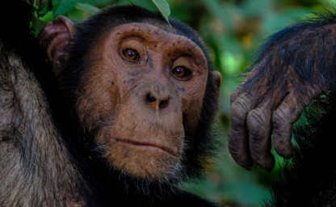

<!-- Section -->
<section>
	<header class="major">
		<h2>Get involved</h2>
	</header>
	

		<article>
			
			

				<h3><a href="{{ 'news' | absolute_url }}">News</a></h3>
				
Catch us at these conferences (and other news)!

			

		</article>
		<article>
			
			

				<h3><a href="{{ 'authorship' | absolute_url }}">Authorship Guidelines</a></h3>
				
As a large scientific collaboration that aims to be inclusive, we developed guidelines and criteria for how to assign authorship to individuals involved in ManyPrimates projects.

			

		</article>
		<article>
			
			

				<h3><a href="{{ 'ethics' | absolute_url }}">Ethics Guidelines</a></h3>
				
We developed ethical guidelines for procedures and participation in ManyPrimates studies.

			

		</article>
		<article>
			
			

				<h3><a href="mailto:{{ site.email }}" target="_blank">Contact</a></h3>
				
We encourage everyone who is interested in primate cognition to get involved. Access to primates is <strong>NOT</strong> a prerequisite.

			

		</article>
	

</section>

<!-- Section -->
<section>
	<header class="major">
		<h2>Publications</h2>
	</header>
	

		<ul>
			<li><strong>ManyPrimates</strong> et al. (<i>submitted</i>) Collaborative open science as a way to reproducibility and new insights in primate cognition research. <i>PsyArXiV</i>. Preprint <a href="https://doi.org/10.31234/osf.io/8w7zd">doi:10.31234/osf.io/8w7zd</a></li>
			<li><strong>ManyPrimates</strong> et al. (2019) Establishing an infrastructure for collaboration in primate cognition research. <i>PLOS ONE 14</i>(10), e0223675. <a href="https://doi.org/10.1371/journal.pone.0223675">doi:10.1371/journal.pone.0223675</a></li>
		</ul>
	

</section>

<!-- Section -->
<section>
	<header class="major">
		<h2>Projects</h2>
	</header>
	

		<article>
			
			<h3>Review of Primate Cognition Research</h3>
			
We conducted a systematic review of primate cognition research published between 2014 and 2019 to quantify sample sizes and identify sampling biases. Based on this survey we outline why many research questions can only be addressed through large-scale collaboration.

			<ul class="actions">
				<li><a href="{{ 'review' | absolute_url }}" class="button">Learn more</a></li>
			</ul>
		</article>
		<article>
			
			<h3>Pilot</h3>
			
As a proof of concept, this study was a first step towards building an infrastructure that facilitates large-scale collaboration in primate cognition research. In this pilot study, we conducted a short-term memory task with 176 primates from 12 species and 11 sites. 

			<ul class="actions">
				<li><a href="{{ 'pilot' | absolute_url }}" class="button">Learn more</a></li>
			</ul>
		</article>
		<article>
			
			<h3>ManyPrimates 1: Short-Term Memory</h3>
			
The first ManyPrimates project is a continuation of our <a href="{{ 'pilot' | absolute_url }}">pilot study</a>. We hope to increase the number of species and individuals per species in order to make meaningful inferences about the evolution of short-term memory abilities in the primate lineage.

			<ul class="actions">
				<li><a href="{{ 'mp1' | absolute_url }}" class="button">Learn more</a></li>
			</ul>
		</article>
		<article>
			
			<h3>ManyPrimates 2</h3>
			
We are currently collecting ideas for the second ManyPrimates project. If you are interested in joining the project, please <a href="mailto:{{ site.email }}" target="_blank">get in touch</a>.

			<ul class="actions">
				<li><a href="{{ 'mp2' | absolute_url }}" class="button">Learn more</a></li>
			</ul>
		</article>
	

</section>
